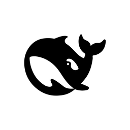
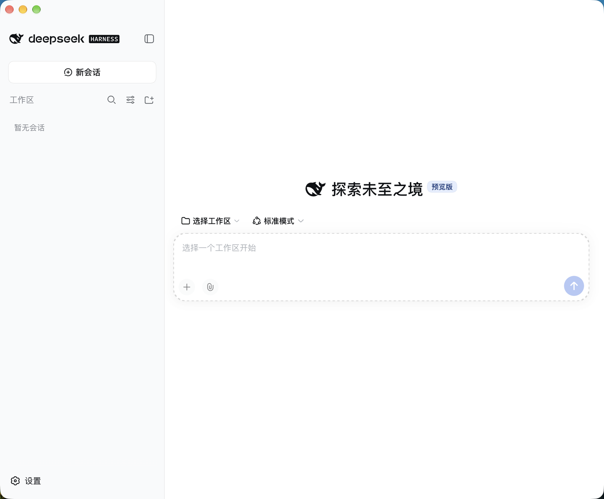

<h1 align="center">
  
  DSH Desktop Min
</h1>

<p align="center">
  把 <a href="https://github.com/deepseek-ai/deepseek-harness">DeepSeek Harness</a> 的官方 Web UI 装进一个原生桌面窗口 —— 不打补丁，不重写前端。
</p>

<p align="center">
  <a href="LICENSE"></a>
  
  
  
  
</p>



<p align="center"><strong>自动拉起本地 Harness，把官方界面放进原生窗口，会话与配置和命令行 <code>dsh</code> 完全互通；升级引擎直接从 npm 拉，不需要重新下载 App。</strong></p>

DSH Desktop Min 不重新实现任何界面，也不修改 Harness 的任何文件。它只做一件事：把 `dsh web` 已经提供的那个界面，装进一个正常的桌面窗口里。壳只使用 DSH 的公开 CLI、环境变量、启动 stdout，以及官方支持的 `--patch` 组合覆盖层；后者仅把 Desktop 的工作区目录选择固定为 DSH 自带的应用内浏览器。

> [!IMPORTANT]
> **未做代码签名与公证。** macOS 首次打开会拦下来，右键点 App → **打开** 即可，或执行一次 `xattr -dr com.apple.quarantine "/Applications/DSH Desktop Min.app"`。Windows 安装包未签名，SmartScreen 会提示「未知发布者」，点「更多信息 → 仍要运行」。
> 提供 **macOS Apple Silicon (arm64)** 与 **Windows (x64)** 构建。

## 下载安装

从 [Releases](../../releases) 下载对应平台的安装包：macOS 是 DMG（拖进「应用程序」），Windows 是 `setup.exe`（每用户安装，**不需要管理员权限**，会建开始菜单快捷方式）。App **自带一份引擎**，所以不需要预装 Node.js 或 dsh，双击就能用。

首次启动、或 App 被覆盖重装后，会先出现一次**可选的初始化向导**，让你挑要不要装社区插件；**默认一个都不勾选**，点「跳过」就直接进入官方界面。

已经用命令行 `dsh` 的人不需要做任何迁移：这个 App **默认共用 `~/.dsh`**，所以终端里的会话、凭据、设置全都在。

### Windows 上的行为

- **关窗 = 收进托盘**，不退出应用 —— 后端与正在跑的长任务继续。从**托盘图标右键 → 退出**（或 `Alt` 唤出菜单 → 文件 → 退出）才真正退出；左键点托盘图标唤回窗口。
- **原生标题栏被隐藏**，顶部只留系统的三个窗口按钮（最小化 / 最大化 / 关闭），内容贴到窗口最上面。
- **菜单栏默认收起**，按 `Alt` 唤出。
- 与 macOS 一致：**共用 `%USERPROFILE%\.dsh`**，所以和终端里的 `dsh` 是同一份会话与配置。


## DSH Desktop Min 带来了什么

Harness 已经提供了 Agent Runtime 和 Web UI。这个壳补齐的是网页做不到的那部分：

- **自动启停 Harness** —— 不需要另开 CLI 或浏览器标签页；壳一退出，后端进程跟着被收干净（两层收尸）
- **原生通知** —— 对话完成、中断、等待人工选择或授权时弹系统通知，点一下回到窗口；靠 tail 会话日志实现，**不往 dsh 里加任何插件**
- **菜单栏升级引擎** —— 检测 / 升级 / 回滚，直接从 npm 拉，**升级 dsh 不需要重新下载 App**
- **升级期间窗口被接管** —— 下载和校验的全程显示真实进度、三道验证关卡和失败原因，而不是只转圈
- **原生窗口手感** —— 修掉了官方 Web UI 当桌面应用时的两个问题：窗口拖不动、红绿灯压住内容
- **与命令行完全互通** —— 共用 `~/.dsh`，会话分桶、凭据、设置和终端里的 `dsh` 是同一份
- **引擎只保留两个版本** —— 当前 + 上一个用于回滚，更旧的自动清理（一个引擎约 280MB）

## 三条设计原则

这个项目的取舍全写在名字里的 **min** 上。

**一、只依赖公开约定，不修改源码。** 壳通过 `web --no-open --host 127.0.0.1 --port <n>` 启动 DSH，使用 `DSH_HOME` 共享数据，读取启动时 stdout 的 URL；同时用官方 `--patch` 参数提供一份静态组合覆盖层，把嵌入式 Desktop 的目录选择固定为 DSH 自带的应用内浏览器。这份覆盖层不改写 DSH 文件，也不写入用户的 `~/.dsh`。

**二、引擎在 App 外面，可独立升级。** 升级过的引擎装在 `~/.dsh-desktop/engines/<版本>/`，版本化目录使得正在跑的那份全程只读。新版本先在隔离环境里过三道关卡（包完整、配置能组装、真能冷启动），通过了才切指针。

**三、壳里带一个真正的 Node。** 不是借 Electron 内置的那个。这一条看起来啰嗦，但它让整整一类问题根本不存在 —— 详见[运行架构](docs/architecture.md)。

## 平台支持

| 平台 | 分发形式 | 状态 |
| --- | --- | --- |
| macOS Apple Silicon | DMG / ZIP（ad-hoc 签名，未公证）| 支持 |
| Windows x64 | `setup.exe`（NSIS，未签名）| 支持 |
| macOS Intel | — | 当前不支持 |
| Linux | — | 当前不支持 |

## 本地数据与安全边界

- Harness 只绑定 `127.0.0.1`，端口由系统分配；token 是进程级的，只接受 `GET /?token=` 一种兑换方式。
- 渲染进程加载的是远端（loopback）页面，因此保持 `contextIsolation` + `sandbox`，**不给 Node 能力**。
- 窗口内不开新窗口，外部链接交给系统浏览器；非 loopback 的导航被拦截。
- 接管页和初始化向导是 App 自带的本地页面，**刻意不引入 preload / IPC** —— 给本地页面开 IPC 等于给远端页面也开一个洞。两者都只用主进程单向 `executeJavaScript` 推状态。
- 会话、凭据、设置都在 `~/.dsh` 里，与命令行 `dsh` 是同一份，**不在** App 安装目录内。

## 和社区同类项目的区别

叫 `dsh-desktop` 的项目有好几个。撇开体量，真正的分歧只有一条：**怎么对待上游**。

社区主流做法是 **vendor 整份 Harness + 叠一层补丁**，功能多得多（手机配对、PPT 生成、安全模式、插件市场），代价是上游每动一次都要跟一次 —— 它们的文档目录里有四份 `harness-*-upgrade.md` 迁移文档。

这个项目走的是另一边：Harness 是一个普通 npm 依赖，壳只依赖公开接口和一份官方支持的组合覆盖层。**功能面窄得多，也没有公证；换来的是上游怎么升都不痛。**

完整对照（含「为什么这条路上不需要 `hmr-fallback`」）见[兼容性与边界](docs/compatibility.md)。

## 文档

- [运行架构](docs/architecture.md) — 启动链、后端生命周期、窗口行为、升级接管页
- [引擎与升级](docs/engine.md) — 菜单栏升级流程、版本保留策略，以及一个会随时间恶化的 cookie 故障
- [原生通知](docs/notifications.md) — 为什么读会话事件流而不是加插件
- [图标](docs/icon.md) — 底板形状怎么对齐 macOS 实测几何、渲染管线
- [开发与配置](docs/development.md) — 环境变量、本地开发、诊断开关
- [兼容性与边界](docs/compatibility.md) — 与社区项目的取舍差异、已知限制

## 开发

```bash
npm install          # 会顺带装好自带引擎用的 node 二进制
npm start            # 开发模式（通知在开发模式下不工作，这是 Electron 的限制）
npm test             # 12 个测试
npm run pack         # 只打包 .app
npm run dist         # 出 DMG + ZIP
npm run icon         # 从官方 favicon 重新生成图标
```

提交改动前请跑 `npm test`，并实际启动一次确认界面正常。**不要**把真实 API Key 写进 Issue、日志或截图。

## 友情链接

- [DeepSeek Harness](https://github.com/deepseek-ai/deepseek-harness) —— 上游项目，本项目只是它的一个外壳。
- [dataelement/dsh-desktop](https://github.com/dataelement/dsh-desktop) —— 社区里做得最完整的同类项目，走的 vendor + 补丁路线；想要手机连接、PPT 生成、安全模式这些功能可以看它。

## 许可证

本项目采用 [MIT License](LICENSE)。

DeepSeek Harness 及其依赖仍遵循各自的上游许可证与商标规则。本项目是**社区项目，非 DeepSeek 官方发行版**。
